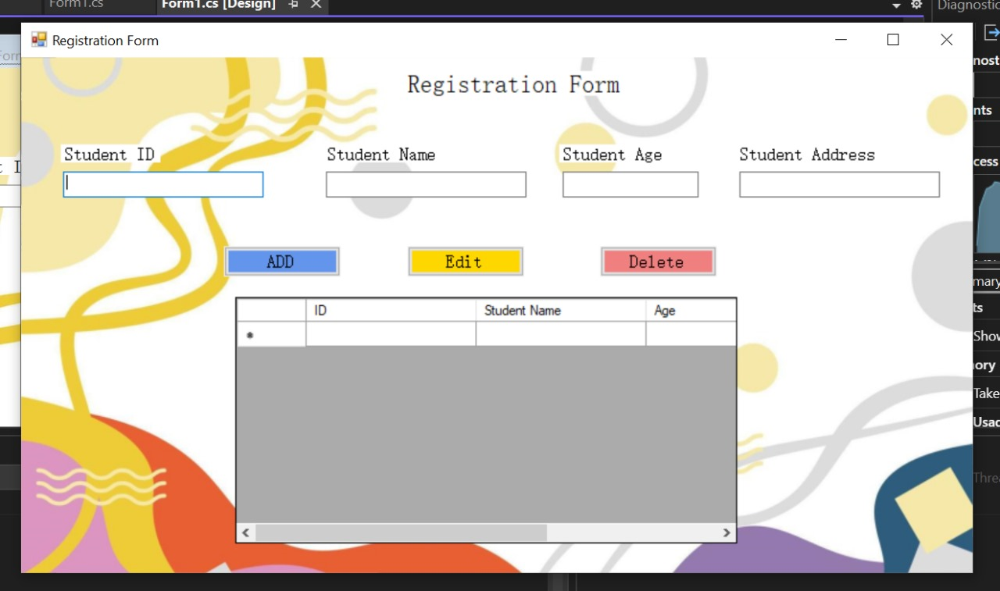

# Project Title

**A Unique .NET Framework Desktop Application**

## Overview

This repository contains a powerful and user-friendly desktop application built on the .NET Framework. Designed to provide a seamless experience, it leverages the robust features of Windows Forms to deliver an intuitive interface and efficient functionality.

## Features

- **User-Friendly Interface**: Built with a focus on user experience, ensuring easy navigation and accessibility.
- **Rich Functionality**: Incorporates advanced features tailored for productivity and efficiency.
- **Cross-Compatibility**: Compatible with various Windows versions, ensuring broad usability.

## Screenshot

Below is a screenshot showcasing the application's main interface:

<div align="center">
  
</div>

## Getting Started

### Prerequisites

- .NET Framework 4.7.2 or later
- Visual Studio 2019 or later
- Windows 10 or later

### Installation

1. Clone this repository:
   ```bash
   git clone https://github.com/farhxn/Windows-Form-UI-C-.git
   ```
2. Open the solution in Visual Studio.
3. Build the solution using the "Build" menu.
4. Run the application from Visual Studio or navigate to the output directory.

## Usage

Once installed, launch the application and explore its features through the intuitive user interface. The application is designed for both novice and experienced users, providing helpful tooltips and documentation within the application.

## Contributing

We welcome contributions! Please follow these steps:

1. Fork the repository.
2. Create a new branch for your feature or bug fix.
3. Commit your changes and push to your fork.
4. Open a pull request.

## License

This project is licensed under the MIT License - see the [LICENSE](LICENSE) file for details.

## Acknowledgments

Special thanks to the .NET community for their continuous support and resources that made this project possible.
